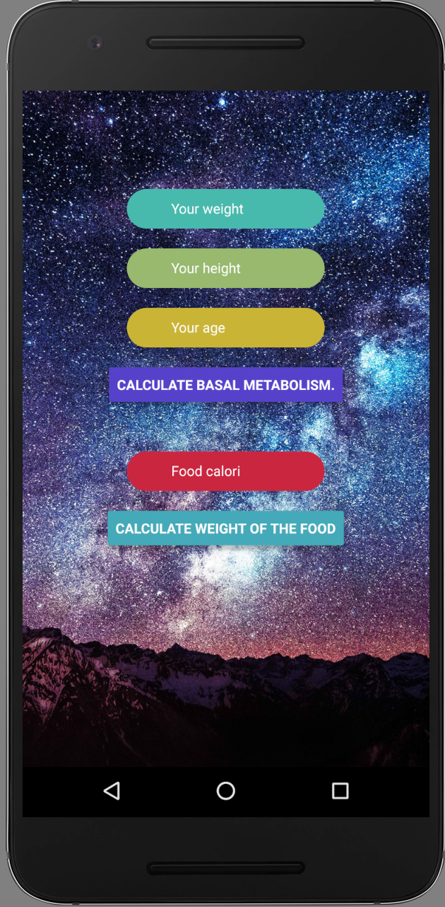

# Basal Metabolism Calculator

**It calculates basal metabolism in kcal and also calculate the calorie as weight.
1 Kg is equal to about 7700 calories.**

# Run on Android
`react-native run-android`

# Run on iOS
`react-native run-ios`